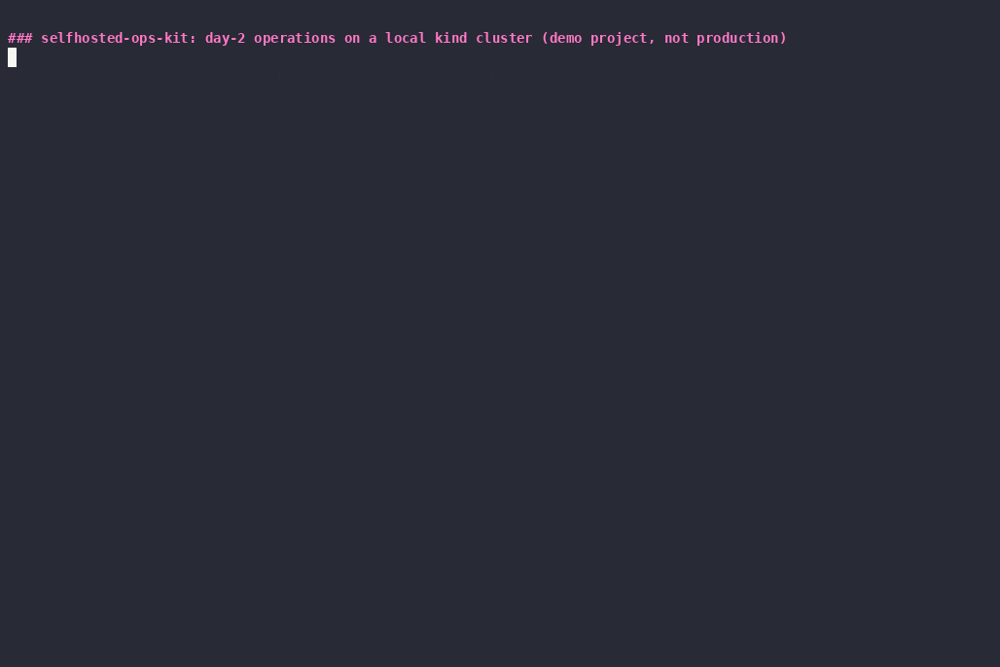
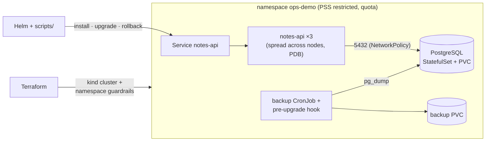

# selfhosted-ops-kit

[](https://github.com/buberlo/selfhosted-ops-kit/actions/workflows/ci.yml?query=branch%3Amain)
[](LICENSE)

A small, runnable showcase of **day-2 operations for a customer-hosted application on Kubernetes**. Install, upgrade, automatic and manual rollback, backup and restore, and network isolation are each written down as a runbook, automated as a script, and **tested end to end in CI on every change**.

> **Scope, honestly:** this is a portfolio/demo project, **not a production product**. The application is a deliberately tiny notes API, PostgreSQL is a single instance, and the backups stay inside the cluster. The [Scope](#scope-and-non-goals) section lists what a real deployment would need on top.

Tools: **Helm 4** · **Terraform** (kind + kubernetes providers) · **GitHub Actions** · kind · PostgreSQL 17 · Bash · a little Python



<sub>Recorded by CI on a GitHub runner (`scripts/demo.sh` under asciinema, idle time capped, sped up 1.5×). Full-resolution cast and logs: [docs/demo/](docs/demo/).</sub>

## What it demonstrates

| Area | What is in the repo | Proven in CI by |
|---|---|---|
| **Helm chart** | App + PostgreSQL StatefulSet; startup/readiness/liveness probes with separate meanings; PDBs; resource requests and limits; topology spread (HA profile); `restricted` Pod Security; generated DB secret kept across upgrades; registry override and digest pinning | `helm lint --strict`, kubeconform on 3 render profiles, a real install into a PSS-`restricted` namespace, `helm test` |
| **Upgrades** | Preflight gate with explicit abort criteria; pre-upgrade backup hook; zero-unavailable rolling update; lock-protected schema migration in an initContainer; `--rollback-on-failure` | Upgrade 1.0.0 → 1.1.0 **under synthetic traffic with 0 failed requests allowed** |
| **Rollback** | Automatic on a failed upgrade; manual to an explicit revision; expand-only migrations so the old code runs on the new schema | A broken upgrade (unpullable image) is rolled back automatically with no client errors; a manual rollback to 1.0.0 keeps data and schema |
| **Backup / restore** | `pg_dump` CronJob with verification and retention; on-demand backup; restore script that stops writers, restores in a single transaction, and resumes | Write A → backup → write B → restore → A present, B gone |
| **Network isolation** | Default-deny ingress; DB reachable only from labelled clients; client egress limited to DB + DNS | A real unlabelled pod is refused, a labelled one connects |
| **Terraform** | kind cluster (1 control plane + 2 workers) and the namespace baseline: PSS `restricted`, ResourceQuota, LimitRange; optional registry mirror | `fmt`, `validate`, `tflint`, then `terraform apply` creates the CI cluster itself |
| **Locked-down sites** | Image list, save/load/push to an internal registry with checksums, no runtime egress | `mirror-images.sh list`; offline render validated with kubeconform |
| **Supportability** | Support-bundle script (no secret values); runbooks with preconditions, abort criteria and escalation paths | The bundle is collected and uploaded automatically when CI fails |

## Architecture



Terraform owns the cluster and the namespace guardrails. Helm owns the release, because upgrade, rollback and history are Helm's job. More detail, including the upgrade sequence and the security posture: [docs/architecture.md](docs/architecture.md).

## Run it locally (one command)

Prerequisites: Docker, [kind](https://kind.sigs.k8s.io/), Terraform ≥ 1.9, Helm 4, kubectl, make, python3. No cloud account is needed. About 4 GB RAM free.

```bash
git clone https://github.com/buberlo/selfhosted-ops-kit && cd selfhosted-ops-kit
make up      # build images → terraform apply (kind) → helm install → helm test   (~4 min)
make test    # the full e2e suite CI runs                                         (~6 min)
make demo    # narrated walkthrough (what the GIF shows)
make down    # terraform destroy
```

`make help` lists every target. Each target is a thin wrapper around a script in [`scripts/`](scripts/), so everything also works without make.

## Runbooks

| Runbook | Covers |
|---|---|
| [install.md](docs/runbooks/install.md) | Preconditions, install, verification, first backup |
| [upgrade.md](docs/runbooks/upgrade.md) | Go/no-go **abort criteria**, upgrade flow, schema-change rules, communication |
| [rollback.md](docs/runbooks/rollback.md) | Rollback vs restore decision, picking the right revision |
| [backup-restore.md](docs/runbooks/backup-restore.md) | Backup design, RPO/RTO, restore procedure, failed-restore handling |
| [troubleshooting.md](docs/runbooks/troubleshooting.md) | Support bundle, triage order, symptom → cause → action tables |
| [offline-install.md](docs/runbooks/offline-install.md) | Air-gapped install: image mirroring, checksums, no egress, change checklist |

## Repository layout

```
app/                 notes-api (Python, ~150 lines) + Dockerfile (non-root)
charts/notes/        Helm chart; values.yaml (laptop) and values-ha.yaml (HA-shaped)
terraform/kind/      kind cluster + namespace baseline (PSS, quota, limits)
scripts/             executable runbooks: up, install, upgrade, rollback, backup-now,
                     restore, netpol-test, traffic, e2e, demo, mirror-images,
                     collect-diagnostics, down
docs/                architecture, runbooks, demo recording
.github/workflows/   CI: lint job + e2e job on kind
```

## Scope and non-goals

What this project deliberately does **not** do, and what a production setup would use instead:

- **PostgreSQL high availability**: single instance here. In production: an operator such as CloudNativePG (replication, failover, WAL archiving, point-in-time recovery) or a managed database.
- **Off-cluster backups**: dumps stay on a PVC in the same cluster. They survive bad upgrades and mistakes, but not losing the cluster. In production: object storage with immutability, plus regular restore drills.
- **Two app versions, one codebase**: 1.0.0 and 1.1.0 are built from the same source with a different version label, and the schema migrations are applied by both. The upgrade mechanics are real; the "feature difference" is not.
- **No Ingress, TLS, cert-manager, image signing, external secret manager or observability stack.** These are environment-specific and would hide the point of the demo.
- **kind is not a customer cluster**: storage is node-local (`local-path`), and NetworkPolicies are enforced by kindnet. The chart is plain Kubernetes, but it has only been tested on kind.
- **The offline flow is documented and partly automated** (image list, save/load/push, registry override rendering). A real disconnected install is not exercised in CI.

## License

[MIT](LICENSE) © 2026 Konrad Kern
