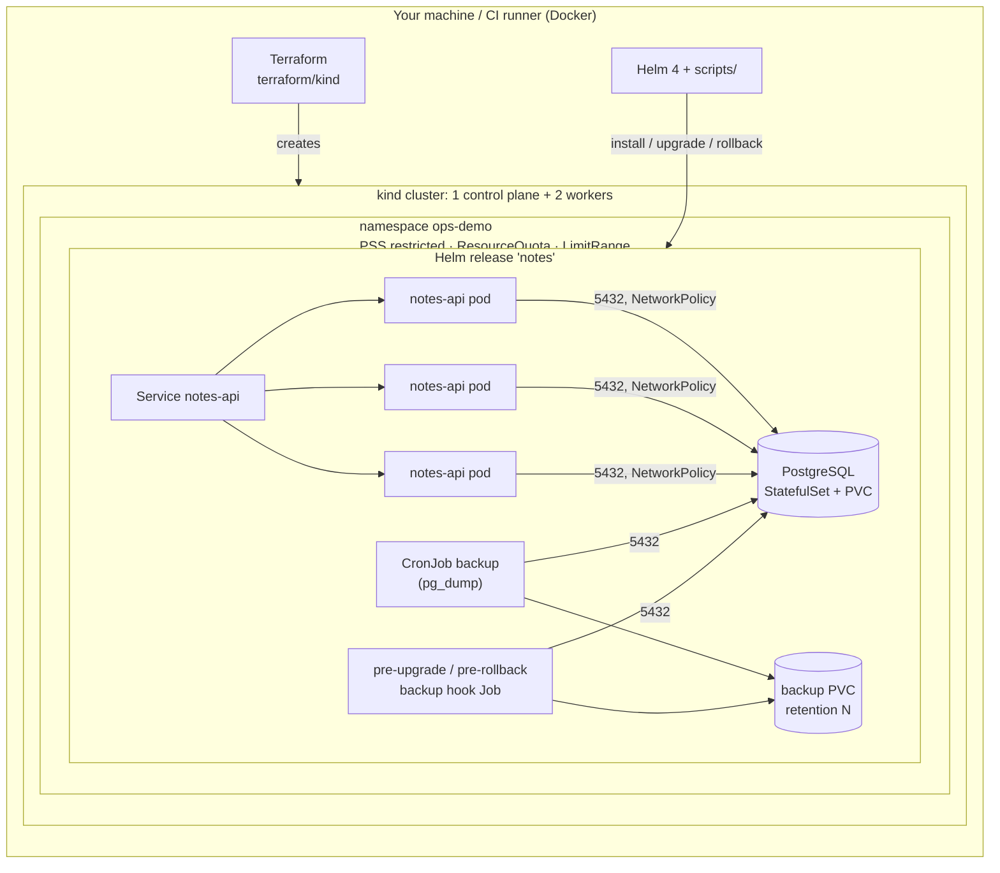
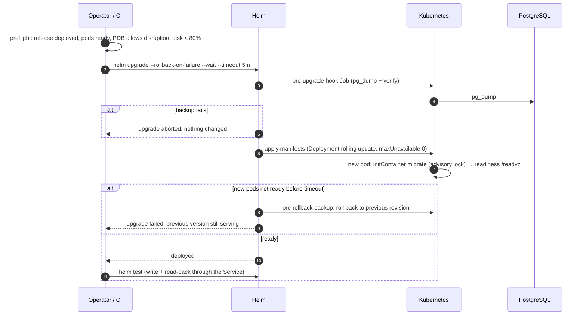

# Architecture

## Components

| Piece | What it is | Why it is built this way |
|---|---|---|
| `app/` | ~180-line Python service (`notes-api`) | Something stateful to operate. Separate liveness (`/healthz`, process only) and readiness (`/readyz`, DB + schema) so a database outage removes pods from the Service instead of restart-looping them. |
| `charts/notes` | Helm chart | The unit a customer installs. All day-2 behaviour (probes, PDB, NetworkPolicies, backups, hooks) is in the chart, not in tribal knowledge. |
| `terraform/kind` | kind cluster + namespace baseline | Free, disposable stand-in for "the customer's cluster" and the guardrails a platform team usually sets (Pod Security `restricted`, quota, default limits). |
| `scripts/` | Bash procedures | The runbooks, executable. CI runs exactly these, so the docs cannot silently drift from what works. |
| `.github/workflows/ci.yml` | Lint + end-to-end on kind | Every change proves install, upgrade, automatic rollback, manual rollback, backup/restore and NetworkPolicy enforcement. |

## Ownership split: Terraform vs Helm

Terraform owns the cluster and the namespace guardrails. Helm owns the application release.

Day-2 operations such as `helm history`, `helm rollback`, hooks and `--rollback-on-failure` are Helm features. If Terraform's `helm_release` owned the release, every upgrade or rollback done by hand would show up as drift on the next `terraform apply`. Splitting at the namespace boundary matches how a lot of customer environments work: the platform team hands over a namespace, and the vendor's chart is installed into it. A GitOps controller (Argo CD, Flux) could take Helm's place without changing the chart.

## Upgrade path in detail

## Security posture (what is and is not covered)

Covered:

- Every pod passes the Pod Security Standard `restricted` profile, and the namespace enforces it. That means non-root, a seccomp profile, no privilege escalation, all capabilities dropped, and a read-only root filesystem everywhere.
- NetworkPolicies: ingress to all release pods is denied by default. PostgreSQL accepts connections only from pods labelled `selfhosted-ops-kit/db-client=true` in the same release, and those clients can only send egress to PostgreSQL and DNS. CI tests this with a real unlabelled pod (`scripts/netpol-test.sh`), so it is not just YAML.
- No service account token is mounted into the API pods.
- The PostgreSQL password is generated once, reused across upgrades, and kept on uninstall so the retained PVC stays readable. `postgres.existingSecret` lets you plug in an externally managed Secret.

Not covered, and out of scope for a demo: TLS between the API and PostgreSQL, Ingress/TLS termination, image signing or admission policy, secret encryption at rest, and an external secret manager.
