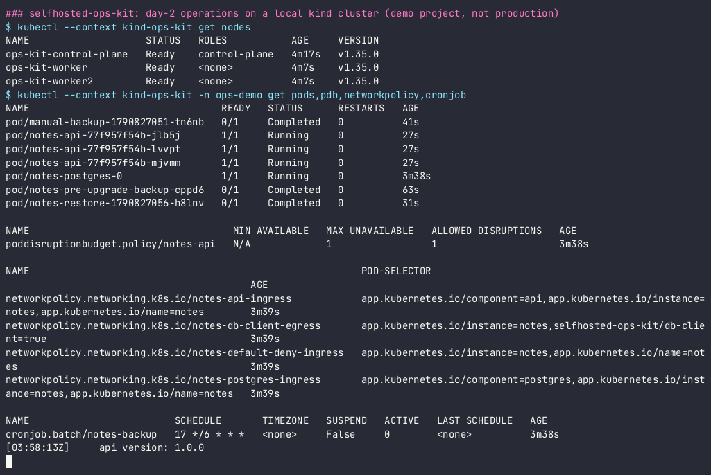
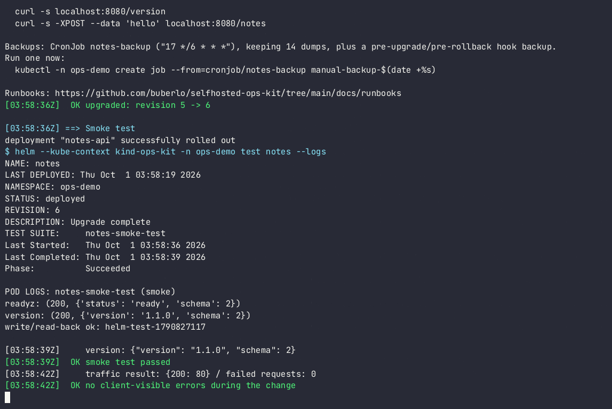
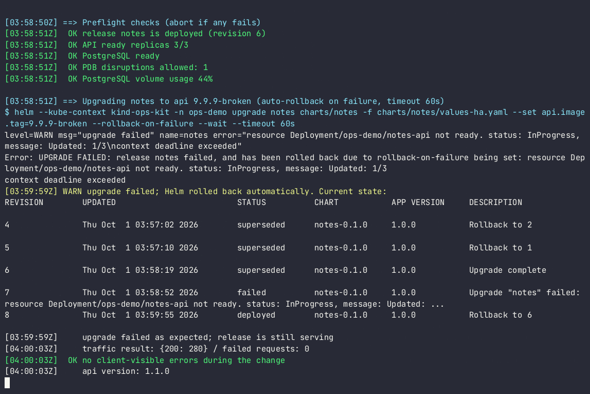
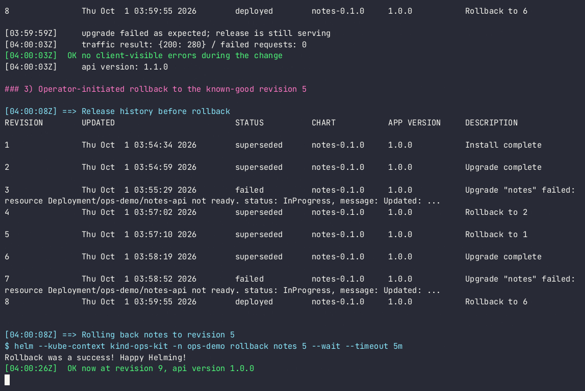

# Demo artifacts

Everything in this folder was produced by CI on a GitHub-hosted runner. Nothing was recorded by hand.

- **Source run:** [actions/runs/36812524936](https://github.com/buberlo/selfhosted-ops-kit/actions/runs/36812524936) (commit `221b432`, 2026-10-01). The run's `e2e-evidence` artifact holds the same files plus the full e2e log, and is kept for 30 days.
- **How:** the `Record demo` step of the `e2e` job runs [`scripts/demo.sh`](../../scripts/demo.sh) under `asciinema rec --headless` right after `make test` has passed on the same cluster. `agg` then renders the GIF. Because the demo runs after the e2e suite, the release history in the recording already contains the e2e revisions.
- **Every push to `main` re-records the demo**, so the CI artifact of the latest run may be newer than the files committed here.

| File | Content |
|---|---|
| [demo.gif](demo.gif) | Full walkthrough, idle time capped at 2.5 s |
| [demo.cast](demo.cast) | asciinema v3 recording: `asciinema play demo.cast` |
| [demo.log](demo.log) | Plain-text output of the same run |
| [0-installed.png](0-installed.png) | Cluster and release after install: 3 nodes, API pods, PDB, NetworkPolicies, backup CronJob |
| [1-upgrade.png](1-upgrade.png) | Upgrade 1.0.0 → 1.1.0: `helm test` passes, 0 failed requests under synthetic traffic |
| [2-auto-rollback.png](2-auto-rollback.png) | Broken release (`9.9.9-broken`): Helm rolls back automatically, 0 failed requests, still serving 1.1.0 |
| [3-rollback.png](3-rollback.png) | Operator rollback to the known-good revision → 1.0.0 |

