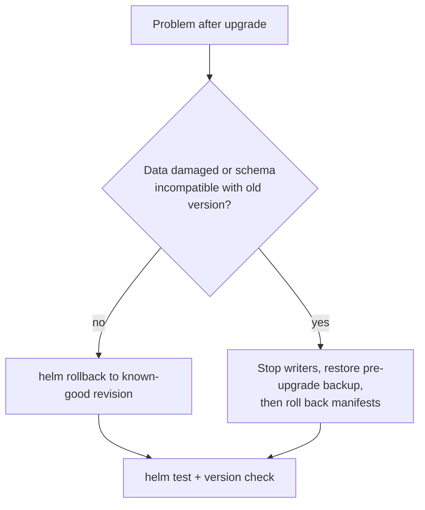

# Runbook: Rollback

| | |
|---|---|
| **Purpose** | Return the application tier to a known-good Helm revision |
| **Duration** | 1–3 min |
| **Risk** | Low for manifests. **Data is not rolled back.** |
| **Automation** | `scripts/rollback.sh <revision>` |

## Decide: rollback or restore?



- **Rollback** fixes bad code, bad config or a bad image. The data stays as it is.
- **Restore** fixes bad data. Everything written since the backup is lost, so the decision needs an owner (in customer environments, the customer).

## Steps

1. **Find the target revision.** Never use "previous" blindly: after an automatic rollback, the previous revision is the *failed* one.
   ```bash
   helm -n ops-demo history notes
   ```
   Pick the last revision whose `DESCRIPTION` is `Install complete` / `Upgrade complete` / `Rollback to N` and that ran the version you want.
2. **Roll back** (the pre-rollback hook takes a backup first):
   ```bash
   ./scripts/rollback.sh 3
   # = helm rollback notes 3 -n ops-demo --wait --timeout 5m  + smoke test
   ```
3. **Verify**: `helm test` passes, `/version` reports the expected version, and the error rate is back to baseline.
4. **Record** the reason and the new revision number. A rollback always creates a *new* revision; history is never rewritten.

## Abort / escalate

- The rollback itself times out → [troubleshooting.md](troubleshooting.md#release-stuck-in-pending-or-failed).
- The old version fails readiness against the current schema → the migration was not backward compatible. Switch to restore ([backup-restore.md](backup-restore.md)).
